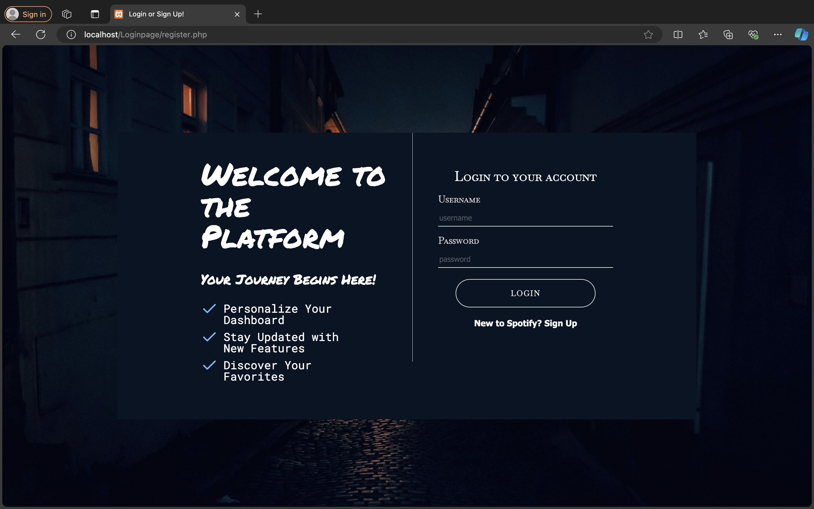
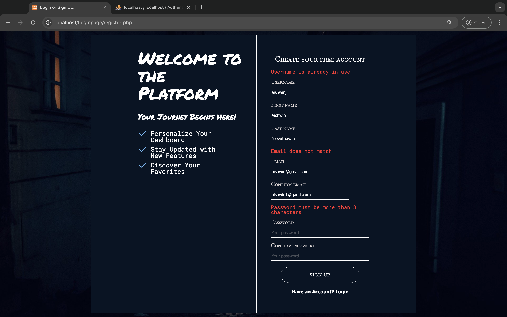
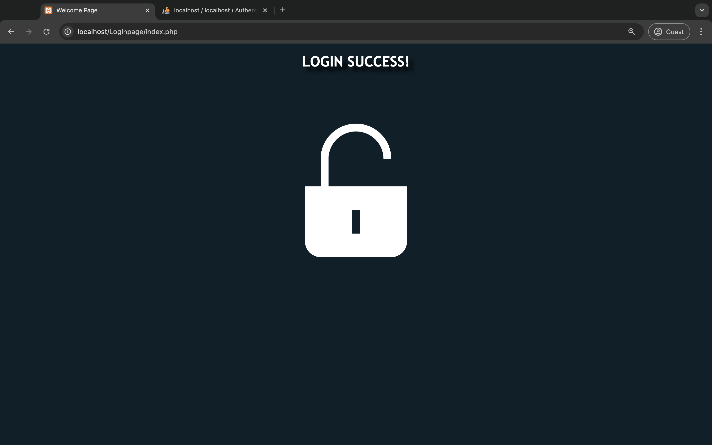
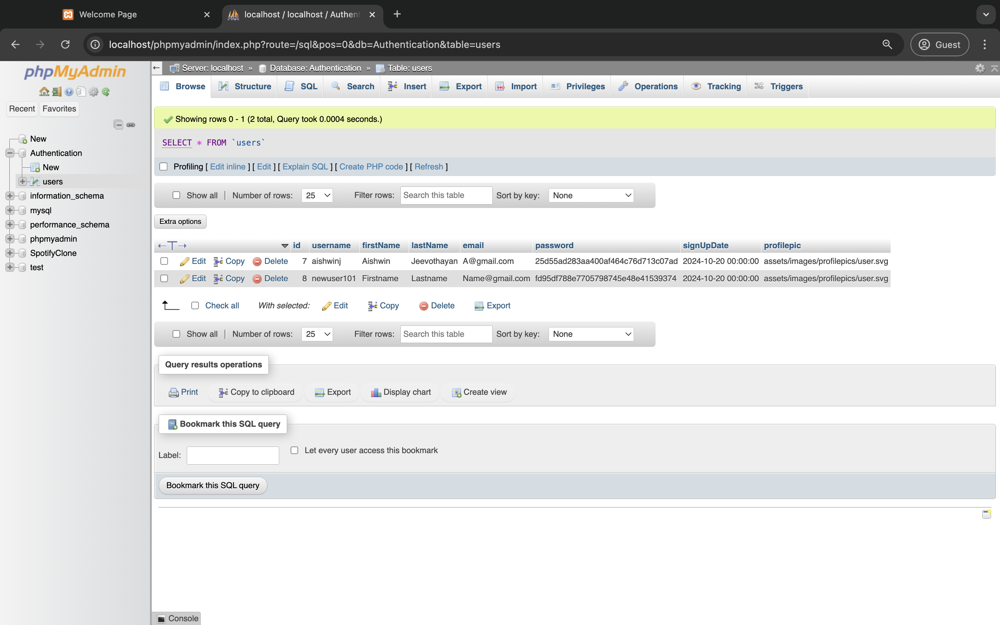
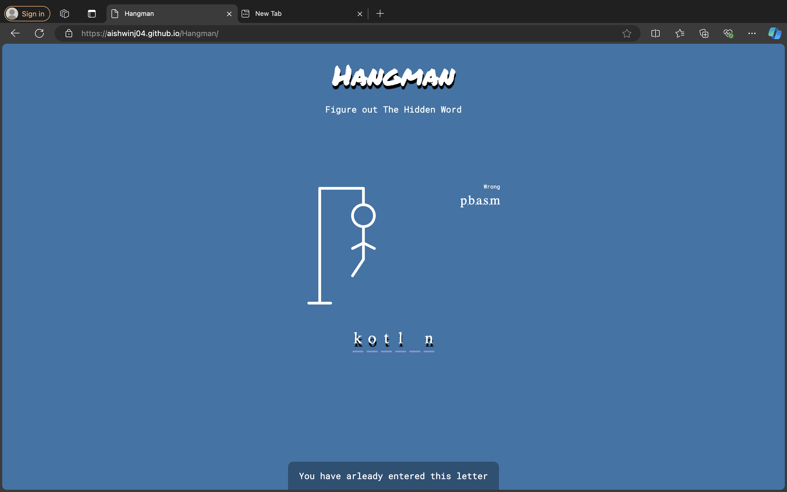

# 👨‍💻 Computer Science Student 
@ Toronto Metropolitan University

---

## Education

**Toronto Metropolitan University**  
_Bachelor of Science in Computer Science_  
CGPA: 3.71  
Relevant Courses: Data Structures & Algorithms, Computer Science, Computer Organization

---

## Technical Skills

**Core Languages:**  
Python, HTML, CSS, JavaScript, PHP    

**Familiar Languages:**  
Swift, Java, C, Lisp  

**Developer Tools:**  
MySQL, Git/GitHub, VSCode, Vim, phpMyAdmin, Linux command line  

**Software:**  
Excel, Office, Figma  

---

## Projects

Here are some of my coding projects:

1. ### **Login Form Authentication**  
   A simple login form with authentication features, including user registration and login validation.  
   - **Language:** PHP, MySQL, HTML, CSS, Javascript  
   - [GitHub Repo](https://github.com/aishwinj04/Authentication-Page)  

   **Login Form Interface:**  
   
   This is the first page users encounter, featuring the main login form and a welcoming message. It allows users to log in if they already have an account or switch to
   the sign-up form to create a new account.

   **Registration Form Interface:**  
   
   The registration form enables new users to create an account. It validates all input before submitting it to the database, ensuring that usernames and emails are not    already in use. Passwords are encrypted using the MD5 hashing algorithm.

   **Success Page:**  
     
   The page users are met with once successfully logging in. 

   **Database Structure:**  
     
   SQL database structure for the users table; each user has their own ID.

3. ### **[Hangman](https://aishwinj04.github.io/Hangman/)**  
   A classic game of Hangman that features words from programming and computer science principles. Each incorrect letter guessed by the player results in a custom SVG stickman adding a body part.  
     
   - **Language:** HTML, CSS, Javascript  
   - [GitHub Repo](https://github.com/aishwinj04/Hangman)

Feel free to check out my other repositories: [GitHub Profile](https://github.com/aishwinj04)

---

## Work Experience

**Material Handler & Bench Technician**  
_Kyndryl (IBM)_  
- Conducted thorough quality checks on electronic components, identifying and resolving issues with defective products. 
- Successfully repaired and troubleshot hardware and software for Elections Canada, RBC, and LifeLabs equipment. 
- Utilized pallet jacks and other material handling equipment to move weekly shipments efficiently.

---

## Co-Curricular Experience

**Event Videographer**  
_Undergraduate Science Society (USSTM)_  
- Collaborated with video editors to communicate specific editing requests and preferences, resulting in a final product that matched expectations.
- Attended meetings, both in-person and virtually, to gather footage for promotional materials, ensuring all content was clear and visually appealing.
- Captured high-quality photos and videos at USSTM related events, increasing awareness of events at Toronto Metropolitan University.

---

## Contact

- [LinkedIn](https://www.linkedin.com/in/aishwin-j-7796a1244/)

---
